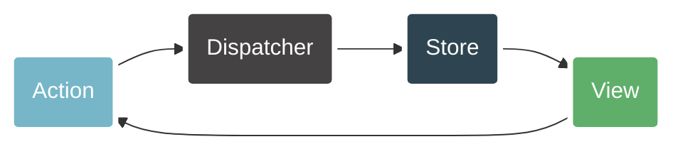

# The Flux Architecture

 
 

 

<v-clicks>

* Application architecture for building user interfaces
* Unidirectional data flow:
* Views send actions to the dispatcher.
* The dispatcher sends actions to every store.
* Stores send data to the views.

</v-clicks>
